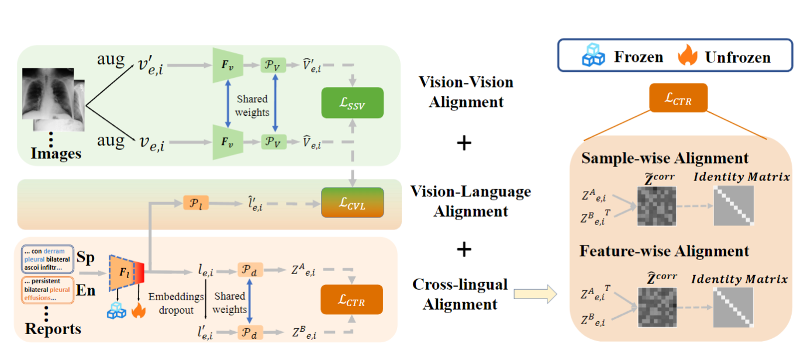

# Med-UniC
official implementation of "Med-Unic: unifying cross-lingual medical vision-language pre-training by diminishing bias"

Source code for the paper entitled [Med-UniC: Unifying Cross-Lingual Medical Vision-Language Pre-Training by Diminishing Bias](https://arxiv.org/abs/2305.19894)
> *Zhongwei Wan, Che Liu, Mi Zhang, Jie Fu, Benyou Wang, Sibo Cheng, Lei Ma, César Quilodrán-Casas, Rossella Arcucci*   
> *The Ohio State University and Imperial College London, etc.*  
Our experiment is build on the framework from [huggingface transformers](https://github.com/huggingface/transformers).4.4.1

The main framework of our Med-UniC is shown in the figure below. 

## Quick Start

### Installation
```
pip install -r requirement.txt
cd finetune/downstream_tasks
pip install -r requirement.txt
```
## Step-by-step Instructions for training/finetuning/zeroshot of Med-UniC
* <u>Build cross-lingual vocab</u>: Construct mixed vocab from Spanish medical corpus.
* <u>Post-pretrain Cross-lingual Medical LM</u>: Use MLM to post-training medical LM to acquire initial cross-lingual ability. 
* <u>Pretrain Med-UniC</u>: Vision-language pretraining for Med-UniC.
* <u>Downstream tasks</u>: Finetune, zeroshot.

### 1. Build cross-lingual vocab
Download pretrain medical vision-language data from Google drive: LINK.
Download checkpoint **CXR-BERT-general: **[huggingface transformers](https://huggingface.co/microsoft/BiomedVLP-CXR-BERT-general/tree/main).
Build cross-lingual vocab:
```
cd generate_mix_corpus/
1.Convert csv to json:
python convert_csv_to_json_en.py
python convert_csv_to_json_sp.py

2. Generate Spanish Vocab:
python generate_CXRBert_vocab.py

3. Merge mixed vocab:
python build_sp_vocab.py

4. Mix en and sp jsons for pretraining:
python mix_json.py

5. tokenize jsons for MLM:
python tokenize_pretrain_data.py
```


